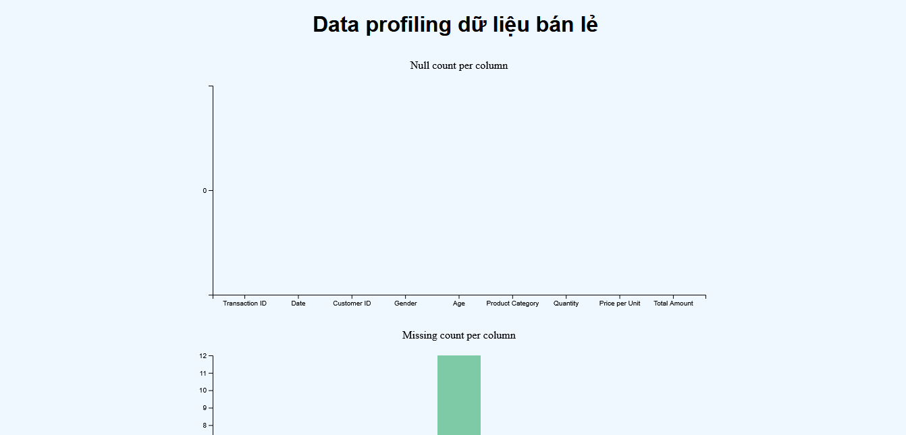

# D3.js - Căn bản và Ứng dụng trong Trực quan hóa dữ liệu

## Cách chạy code

- Lưu ý cần thực hiện các bước sau thì code mới chạy được, không thì trang gặp lỗi trắng bóc (thường là lỗi CORS do không load được) với lỗi như sau trong console:

```
Cross-Origin Request Blocked: The Same Origin Policy disallows reading the remote resource at file:///C:/Users/admin/Documents/DataVisualization/Ex1_D3/retail_sales_dataset.csv. (Reason: CORS request not http).
```

- Đầu tiên mấy ông tải và cài Python về (phiên bản mới kiểu từ 3.10 trở lên, vì mấy phiên bản sau có hỗ trợ server http cơ bản (tất nhiên không đầy đủ như ngnix hay Apache, nhưng mà vẫn chạy được)).
- Vào thư mục Ex1_D3 chứa DataProfiling.html bằng cách gõ <code>cd Ex1_D3</code> (hoặc nếu như trong VS Code mở thư mục Ex1_D3, rồi Terminal -> New Terminal là cũng vào được luôn)
- Từ terminal, cmd, powershell: gõ <code>python -m http.server [port]</code>, ví dụ <code>python -m http.server 8000</code>.
- Rồi vào trình duyệt web như Chrome/Edge/Firefox/..., gõ http://localhost:[port], ví dụ thì là http://localhost:8000, hiện ra trang Directory listing for \/, dò tới DataProfiling.html, nấp đúp chuột vào file này. Thế là xong.

- Nếu được giống thế này là ổn rồi đấy:


## Lưu ý

jesse-tong: Cái này là file Markdown tạo ra bởi GitHub Copilot với Claude để giải thích về d3.js cho mấy ông, đừng có thêm vào lúc nộp, chỉ nộp file data-visualization.js, DataProfiling.html với file report (nếu có) thôi.


## 1. D3.js là gì?

D3 (Data-Driven Documents) là một thư viện JavaScript mạnh mẽ được sử dụng để tạo ra các trực quan hóa dữ liệu động và tương tác trên web. Được phát triển bởi Mike Bostock, D3.js cho phép gắn dữ liệu vào các phần tử DOM (Document Object Model) và áp dụng các phép biến đổi dựa trên dữ liệu đó.

**Ưu điểm chính:**
- Tính linh hoạt cao
- Hiệu suất tốt với lượng dữ liệu lớn
- Khả năng tương tác phong phú
- Hỗ trợ nhiều loại biểu đồ và trực quan hóa

## 2. Các khái niệm cơ bản

### Selections (Lựa chọn)

D3 cho phép chọn các phần tử DOM bằng cú pháp tương tự jQuery:

```javascript
// Chọn một phần tử theo ID
const svg = d3.select("#date-chart");

// Chọn nhiều phần tử
const bars = d3.selectAll("rect");
```

### Data Binding (Liên kết dữ liệu)

D3 cho phép liên kết dữ liệu với các phần tử DOM:

```javascript
// Liên kết dữ liệu với các phần tử DOM
const bars = svg.selectAll("rect")
  .data(dataArray)
  .join("rect")
  .attr("width", d => d.value); // Sử dụng dữ liệu để thiết lập thuộc tính
```

## 3. Scales (Tỷ lệ)

Scales là các hàm chuyển đổi giữa miền dữ liệu (domain) và miền hiển thị (range).

### Các loại scales phổ biến:

#### Linear Scale

```javascript
// Từ đoạn mã trong chart.js
const y = d3.scaleLinear()
  .domain([0, d3.max(monthlyData, d => d.totalAmount)])
  .nice()
  .range([height, 0]);
```

- `domain()`: Xác định phạm vi giá trị đầu vào
- `range()`: Xác định phạm vi giá trị đầu ra
- `nice()`: Làm tròn domain đến giá trị đẹp hơn

#### Time Scale

```javascript
// Từ đoạn mã trong chart.js
const x = d3.scaleTime()
  .domain(d3.extent(monthlyData, d => d.date))
  .range([0, width]);
```

#### Band Scale (cho biểu đồ cột)

```javascript
// Từ đoạn mã trong chart.js
const fx = d3.scaleBand()
  .domain(ages)
  .range([ageChartMargin.left, ageChartWidth - ageChartMargin.right])
  .padding(0.1);
```

- `padding()`: Tạo khoảng cách giữa các cột

#### Ordinal Scale (cho màu sắc)

```javascript
const color = d3.scaleOrdinal()
  .domain(quantityAndTotalAmountByGender.map(d => d.gender))
  .range(d3.quantize(t => d3.interpolateSpectral(t * 0.8 + 0.1), quantityAndTotalAmountByGender.length).reverse());
```

## 4. Transform/Translate trong SVG

Transform cho phép di chuyển, xoay, và thay đổi kích thước các phần tử SVG:

```javascript
// Di chuyển nhóm phần tử theo tọa độ (x, y)
dateChartGraph.append("g")
  .attr("transform", `translate(${margin.left}, ${margin.top})`);

// Di chuyển và xoay trục x
dateChartGraph.append("g")
  .attr("transform", `translate(0, ${height})`)
  .call(xAxis);
```

Cú pháp: `translate(x, y)` di chuyển phần tử đến vị trí (x, y).

## 5. Axes (Trục tọa độ)

D3.js cung cấp các hàm để tạo trục tọa độ:

```javascript
// Tạo trục tọa độ ngang (bottom)
const xAxis = d3.axisBottom(x)
  .tickFormat(d3.timeFormat("%b %Y"));

// Tạo trục tọa độ dọc (left)
const yAxis = d3.axisLeft(y);

// Vẽ trục lên SVG
dateChartGraph.append("g")
  .attr("transform", `translate(0, ${height})`)
  .call(xAxis);
```

Các loại trục:
- `d3.axisTop()`: Trục nằm phía trên
- `d3.axisRight()`: Trục nằm bên phải
- `d3.axisBottom()`: Trục nằm phía dưới
- `d3.axisLeft()`: Trục nằm bên trái

## 6. Các loại biểu đồ trong chart.js

### Line Chart (Biểu đồ đường)

```javascript
// Định nghĩa đường
const line = d3.line()
  .x(d => x(d.date))
  .y(d => y(d.totalAmount));

// Vẽ đường
dateChartGraph.append("path")
  .datum(monthlyData)
  .attr("class", "line-chart")
  .attr("d", line);
```

### Bar Chart (Biểu đồ cột)

```javascript
// Vẽ các cột
ageChartAmount.append("g").attr("fill", "steelblue").selectAll()
  .data(dataByAges).join("rect").attr("x", (d) => fx(d.ageGroup))
  .attr("y", (d) => yTotalAmount(d.totalAmount))
  .attr("height", (d) => yTotalAmount(0) - yTotalAmount(d.totalAmount))
  .attr("width", fx.bandwidth());
```

### Pie Chart (Biểu đồ tròn)

```javascript
// Tạo dữ liệu cho biểu đồ tròn
const quantityPie = d3.pie().sort(null).value(d => d.totalQuantity);
const quantityArcs = quantityPie(quantityAndTotalAmountByGender);

// Tạo hình cung
const quantityArc = d3.arc().innerRadius(0).outerRadius(Math.min(width, height) / 2 - 1);

// Vẽ biểu đồ tròn
genderChartQuantity.append("g").attr("stroke", "white")
  .selectAll().data(quantityArcs).join("path")
  .attr("fill", d => color(d.data.gender))
  .attr("d", quantityArc);
```

## 7. Tương tác và sự kiện

### Tooltip (Chú thích)

```javascript
// Tạo tooltip
const tooltip = d3.select("#tooltip");

// Thêm sự kiện cho cột trong biểu đồ
.on("mouseover", function(event, d) {
  tooltip.transition()
    .duration(200)
    .style("opacity", 1);
  tooltip.html(`Nhóm tuổi: ${d.ageGroup}<br>Tổng doanh thu: ${d.totalAmount}`)
    .style("left", (event.pageX + 5) + "px")
    .style("top", (event.pageY - 28) + "px");
})
.on("mousemove", function(event) {
  tooltip.style("left", (event.pageX + 5) + "px")
    .style("top", (event.pageY - 28) + "px");
})
.on("mouseout", function() {
  tooltip.transition()
    .duration(500)
    .style("opacity", 0);
});
```

## 8. Phân tích ứng dụng trong chart.js

### Xử lý dữ liệu

1. **Tải dữ liệu CSV**:

```javascript
d3.csv("retail_sales_dataset.csv").then(data => {
  // Xử lý dữ liệu
});
```

2. **Phân nhóm dữ liệu**:

```javascript
// Nhóm theo tháng
const groupedData = d3.group(data, d => d3.timeMonth(d.date));

// Nhóm theo nhóm tuổi
const groupedData = d3.group(data, d => d.ageGroup);

// Nhóm theo loại sản phẩm
const groupedData = d3.group(data, d => d.productCategory);
```

3. **Tính toán tổng hợp**:

```javascript
// Tính tổng
d3.sum(values, d => d.totalAmount)

// Tính trung bình
d3.mean(values, d => d.pricePerUnit)

// Tìm giá trị max
d3.max(dataByProducts, d => d.averagePrice)
```

### Bố cục biểu đồ

```javascript
// Thiết lập kích thước và margin
const margin = {top: 50, right: 30, bottom: 40, left: 40};
const width = +date_chart_svg.attr("width") - margin.left - margin.right;
const height = +date_chart_svg.attr("height") - margin.top - margin.bottom;

// Tạo nhóm để vẽ biểu đồ
const dateChartGraph = date_chart_svg.append("g")
  .attr("transform", `translate(${margin.left}, ${margin.top})`);
```

### Tùy chỉnh trục tọa độ

```javascript
// Định dạng nhãn trục x
const xAxis = d3.axisBottom(x).tickFormat(d3.timeFormat("%b %Y"));

// Tùy chỉnh kích thước tick
.call(d3.axisBottom(fx).tickSizeOuter(0));
```

### Thêm tiêu đề biểu đồ

```javascript
dateChartGraph.append("text")
  .attr("class", "title")
  .attr("x", width / 2)
  .attr("y", -1 * margin.top / 2)
  .attr("text-anchor", "middle")
  .text("Tổng doanh thu theo từng tháng");
```

## 9. Tóm tắt các biểu đồ trong mã nguồn

### 1. Biểu đồ đường theo thời gian
- Hiển thị tổng doanh thu và số lượng sản phẩm theo tháng
- Sử dụng `d3.line()` và `d3.scaleTime()`

### 2. Biểu đồ tròn theo giới tính
- Hiển thị phân phối doanh thu và số lượng theo giới tính
- Sử dụng `d3.pie()` và `d3.arc()`

### 3. Biểu đồ cột theo nhóm tuổi
- Hiển thị tổng doanh thu, số lượng sản phẩm và giá trung bình theo nhóm tuổi
- Sử dụng `d3.scaleBand()` và rectangles

### 4. Biểu đồ cột theo loại sản phẩm
- Hiển thị tổng doanh thu, số lượng sản phẩm và giá trung bình theo loại sản phẩm
- Sử dụng `d3.scaleBand()` và rectangles

## 10. Kết luận

D3.js là một thư viện mạnh mẽ cho phép tạo ra các trực quan hóa dữ liệu đa dạng và tương tác. Ứng dụng trong chart.js đã minh họa cho nhiều khái niệm cơ bản của D3 như:

- Lựa chọn và liên kết dữ liệu
- Tỷ lệ (scales) cho các trục tọa độ
- Transform cho việc bố trí
- Trục tọa độ và nhãn
- Các loại biểu đồ khác nhau (đường, cột, tròn)
- Tương tác với người dùng thông qua tooltips

Với những kiến thức cơ bản này, bạn có thể tiếp tục khám phá và phát triển các trực quan hóa dữ liệu phức tạp hơn bằng D3.js.
