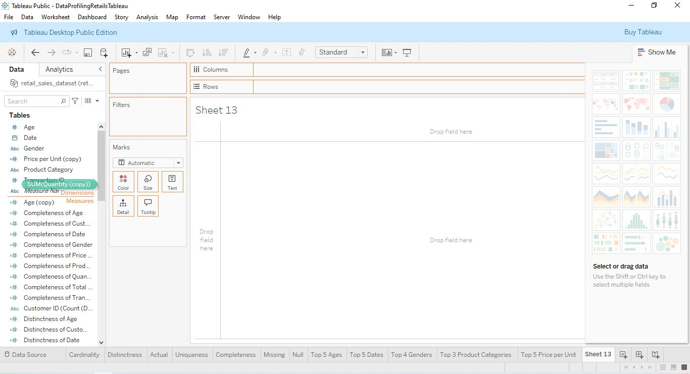
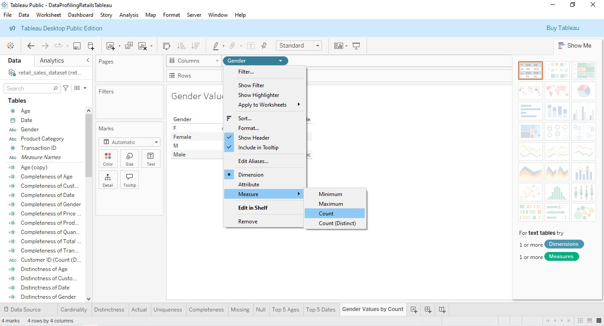
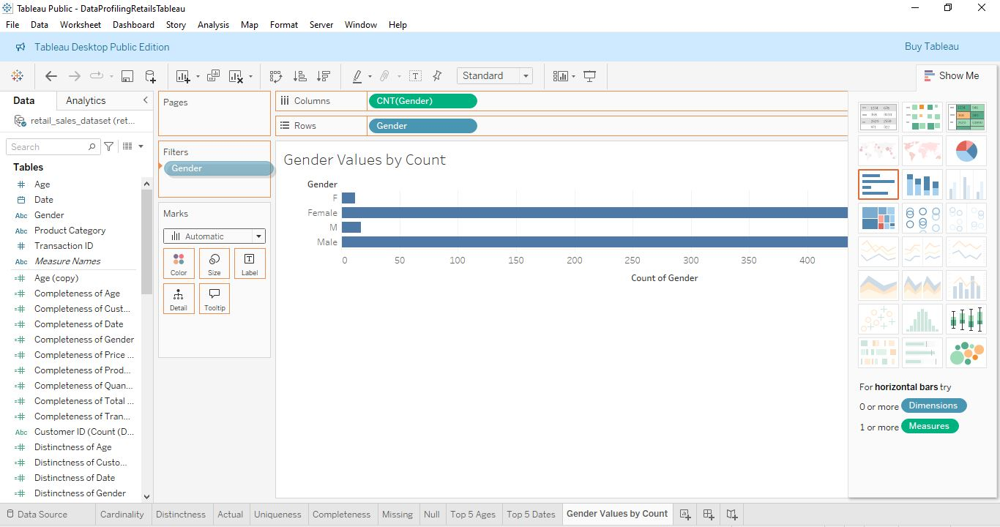
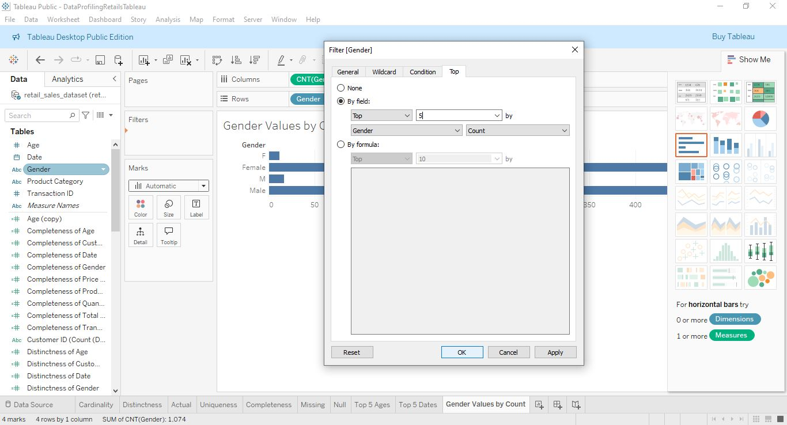
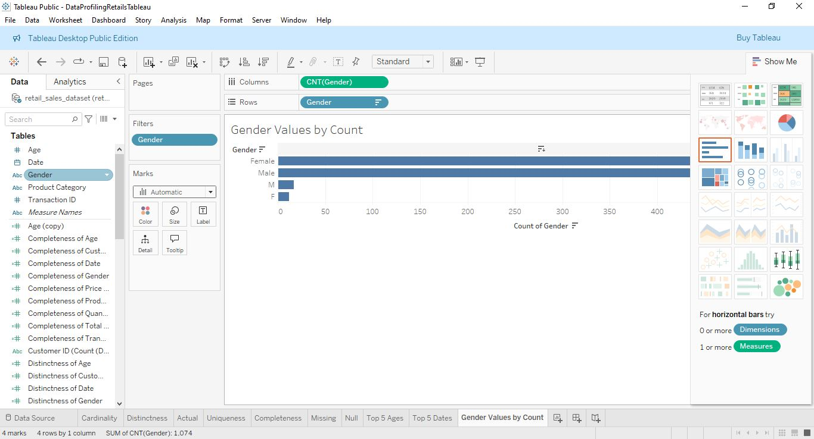

# Hướng Dẫn Sử Dụng Tableau Workbook Phân Tích Dữ Liệu

*Tài liệu này được tạo bởi Claude AI (có chỉnh sửa một chút bởi tui) để giải thích workbook Tableau Retail Sales Data Profiling*

## Giới Thiệu

Tài liệu này cung cấp hướng dẫn về cách hiểu và sử dụng workbook Tableau tập trung vào phân tích và kiểm tra chất lượng dữ liệu (Data Profiling). Workbook này đã được tạo để trực quan hóa và phân tích các khía cạnh khác nhau của bộ dữ liệu bán lẻ (retail sales dataset).

## Hướng Dẫn CreateFilterChart

Các file `CreateFilterChart0.JPG` đến `CreateFilterChart4.JPG` là hướng dẫn từng bước để tạo biểu đồ hiển thị top 5 giá trị trong Tableau. Các hình ảnh này minh họa quy trình:


1. Chọn dữ liệu nguồn (đối với measure values (màu xanh lá) thì cần phải tạo 1 copy bằng cách nhấp chuột phải chọn Duplicate, sau đó kéo cái copy lên đầu để biến nó thành measure name).

2. Tạo các calculated field cần thiết (nhấp chuột phải vào measure phía bên trái)

3. Thêm dimension và measure vào các giá trị hàng (rows) và cột (columns) bằng cách kéo các measure vào (lưu ý là với rows thì lấy số hàng của từng giá trị bằng cách nhấp chuột phải vào cái trên rows, chọn Measure -> Count).

4. Áp dụng filter (lưu ý là ở trong filter thì mục thứ 2 ở phần By Field thì chọn Field đúng với tên trên column và ở đây thì là các giá trị có số lượng nhiều nhất ta chọn count,) và sắp xếp để hiển thị top 5 giá trị

5. Định dạng biểu đồ cuối cùng (chọn vào phía trên vài lần sao cho sắp xếp đúng thứ tự với phía dưới biểu đồ hiện icon như hình).

## Khái Niệm [measure] trong Tableau

Trong Tableau, `[measure]` đề cập đến một trường dữ liệu cụ thể trong tập dữ liệu mà bạn muốn phân tích. Khi tạo calculated field, bạn sẽ thay thế `[measure]` bằng tên thực tế của trường dữ liệu (ví dụ: `[Age]`, `[Price per Unit]`, `[Gender]`, v.v.). Measure thường là các giá trị số có thể tính toán, trong khi dimension thường là các thuộc tính phân loại hoặc thời gian.

## Các Công Thức Calculated Field cho Data Profiling

### 1. Completeness

```
SUM(IF NOT ISNULL([measure]) THEN 1 ELSE 0 END)/ COUNT([measure])
```

**Giải thích**: Công thức này tính tỷ lệ giữa số lượng bản ghi không bị NULL và tổng số bản ghi. Kết quả là phần trăm dữ liệu đầy đủ.

**Lưu ý**: Trong Tableau, các thuộc tính không đúng định dạng với kiểu dữ liệu của trường cũng được xem là null (không phải missing), điều này có thể dẫn đến kết quả khác so với d3.js.

### 2. Distinctness

```
COUNTD([measure]) / SUM(IF NOT ISNULL([measure]) AND NOT [measure] = "" THEN 1 ELSE 0 END)
```

**Giải thích**: Công thức này tính tỷ lệ giữa số lượng giá trị khác nhau và số lượng bản ghi không bị NULL hoặc rỗng.

**Lưu ý**: Đối với các kiểu dữ liệu không phải chuỗi (như số, ngày tháng), điều kiện `AND NOT [measure] = ""` không cần thiết và không thể so sánh được, vì vậy nên bỏ qua phần này:

```
COUNTD([measure]) / SUM(IF NOT ISNULL([measure]) THEN 1 ELSE 0 END)
```

### 3. Null (Giá trị NULL)

```
SUM(IF ISNULL([measure]) THEN 1 ELSE 0 END)
```

**Giải thích**: Công thức này đếm số lượng bản ghi có giá trị NULL.

### 4. Missing

```
SUM(IF ISNULL([measure]) AND [measure] = "" THEN 1 ELSE 0 END)
```

**Giải thích**: Công thức này đếm số lượng bản ghi bị thiếu (NULL hoặc chuỗi rỗng). 

**Lưu ý**: Đối với các kiểu dữ liệu không phải chuỗi, công thức này tương đương với công thức tính NULL, vì các kiểu dữ liệu này không thể có giá trị chuỗi rỗng.

### 5. Uniqueness

```
COUNTD([measure]) / COUNT([measure])
```

**Giải thích**: Công thức này tính tỷ lệ giữa số lượng giá trị khác nhau và tổng số bản ghi. Kết quả càng gần 1 thì trường dữ liệu càng có nhiều giá trị duy nhất.

### 6. Cardinality

Cardinality là số lượng giá trị duy nhất trong một trường dữ liệu, được tính bằng hàm:

```
COUNTD([measure])
```

### 7. Actual (Giá trị thực tế)

Phần Actual không phải là một calculated field mà là việc sử dụng filter để hiển thị dữ liệu thực tế. Bạn có thể:
- Lọc theo các giá trị cụ thể
- Hiển thị top N giá trị dựa trên một measure
- Lọc theo range, date range, v.v.

## Các Biểu Đồ Được Tạo Ra Trong Workbook

Workbook bao gồm nhiều biểu đồ khác nhau để phân tích dữ liệu:

1. **Biểu đồ Completeness**: Hiển thị độ đầy đủ của các trường dữ liệu
2. **Biểu đồ Distinctness**: Hiển thị độ khác biệt của các trường dữ liệu
3. **Biểu đồ Null**: Hiển thị số lượng giá trị NULL trong từng trường
4. **Biểu đồ Missing**: Hiển thị số lượng giá trị thiếu trong từng trường
5. **Biểu đồ Uniqueness**: Hiển thị độ duy nhất của các trường dữ liệu
6. **Biểu đồ Cardinality**: Hiển thị số lượng giá trị duy nhất trong từng trường
7. **Top 5 Charts**: Các biểu đồ hiển thị top 5 giá trị thường gặp nhất của các dimension như Age, Gender, Product Category, v.v.

## Lưu Ý Khi Sử Dụng Workbook

- Cách Tableau xử lý dữ liệu missing và null có thể khác với các công cụ khác như d3.js
- Các giá trị không phù hợp với kiểu dữ liệu của trường cũng được xem là null trong Tableau
- Khi tạo calculated field, hãy chú ý đến kiểu dữ liệu của trường để áp dụng công thức phù hợp
- Lưu ý là mỗi biểu đồ bên trái thì cần yêu cầu số lượng measures values và measure names khác nhau, ở mấy cái biểu đồ như completeness hay cardinality thì do thiếu trường có thể không chọn được biểu đồ 1 cột/1 hàng (cái thứ 7 bên phải), nếu thế thì thêm measures vào như date rồi chọn biểu đồ, xong rồi bỏ nó ra.

---

Workbook này giúp bạn nhanh chóng đánh giá chất lượng dữ liệu, xác định các vấn đề tiềm ẩn và đưa ra quyết định dựa trên dữ liệu đáng tin cậy.